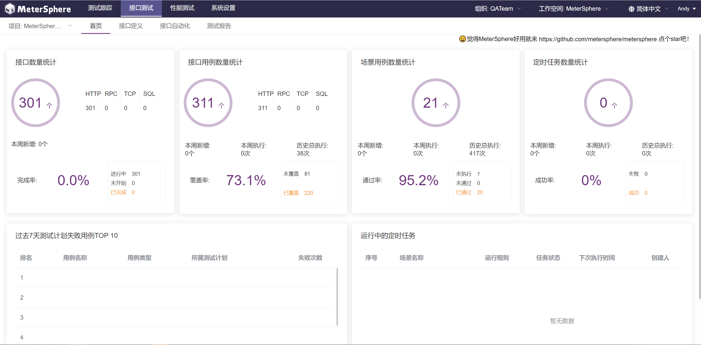

# 项目介绍

欢迎使用 MeterSphere。

MeterSphere 是一站式的开源企业级持续测试平台，涵盖测试用例管理、接口测试、性能测试、Mock 服务等功能，兼容JMeter 等开源标准，有效助力开发和测试团队充分利用云弹性进行高度可扩展的自动化测试，加速高质量软件的交付。

## 界面展示

!!! info "更多截图"
    点击[这里]()查看更多功能截屏及演示视频

## 技术优势
  
- Full-Cycle 全生命周期: 能够覆盖从测试计划到测试执行、测试报告分析的不同阶段
- Automation  & Scalability 自动化 & 扩展性: 支持接口和性能的自动化测试，可以充分利用云弹性实现超大规模的性能测试
- Continuous Test 持续测试: 能够与持续集成工具无缝集成，支撑企业实现测试左移
- Collaboration 团队协作: 支持不同规模的测试团队，小到几个人的测试团队、大到数百人的测试中心

## 主要功能

<!-- 添加截图 -->
- 测试跟踪: 远超 TestLink 的使用体验
- 接口测试: 类似 Postman 的体验, 天然支持团队协作
- 性能测试: 兼容 JMeter，支持 Kubernetes 和云环境，
轻松支持高并发、分布式的性能测试
- 系统管理: 用户管理、租户管理、权限管理、团队协作

## 功能列表

<table>
    <tbody>
        <tr>
            <td rowspan="10">测试跟踪</td>
            <td>项目管理</td>
            <td>多项目支持，测试用例、测试计划与项目关联</td>
        </tr>
        <tr>
            <td rowspan="4">测试用例管理</td>
            <td>在线编辑用例</td>
        </tr>
        <tr>
            <td>以树状形式展示项目的模块及其用例</td>
        </tr>
        <tr>
            <td>自定义用例属性</td>
        </tr>
        <tr>
            <td>快速导入用例到系统</td>
        </tr>
        <tr>
            <td rowspan="5">测试计划跟踪</td>
            <td>基于已有用例发起测试计划</td>
        </tr>
        <tr>
            <td>在线更新用例执行结果</td>
        </tr>
        <tr>
            <td>灵活的用例分配方式</td>
        </tr>
        <tr>
            <td>在线生成测试报告，支持自定义测试报告模板</td>
        </tr>
        <tr>
            <td>与平台中的接口测试、性能测试功能结合，自动更新关联用例的结果</td>
        </tr>
        <tr>
            <td rowspan="7">接口测试</td>
            <td rowspan="5">测试脚本</td>
            <td>在线编辑接口测试内容</td>
        </tr>
        <tr>
            <td>支持参数化测试</td>
        </tr>
        <tr>
            <td>灵活多样的断言支持</td>
        </tr>
        <tr>
            <td>支持多接口的场景化测试</td>
        </tr>
        <tr>
            <td>通过浏览器插件快速录制测试脚本</td>
        </tr>
        <tr>
            <td rowspan="2">测试报告</td>
            <td>测试执行后自动生成测试报告</td>
        </tr>
        <tr>
            <td>测试报告导出</td>
        </tr>
        <tr>
            <td rowspan="9">性能测试</td>
            <td rowspan="5">测试脚本</td>
            <td>完全兼容&nbsp;JMeter&nbsp;脚本</td>
        </tr>
        <tr>
            <td>在线调整压力参数</td>
        </tr>
        <tr>
            <td>分布式压力测试</td>
        </tr>
        <tr>
            <td>支持参数化测试</td>
        </tr>
        <tr>
            <td>通过浏览器插件快速录制测试脚本</td>
        </tr>
        <tr>
            <td rowspan="4">测试报告</td>
            <td>测试执行后自动生成测试报告</td>
        </tr>
        <tr>
            <td>丰富的测试报告展现形式</td>
        </tr>
        <tr>
            <td>测试报告导出</td>
        </tr>
        <tr>
            <td>查看测试日志详情</td>
        </tr>
        <tr>
            <td rowspan="6">系统管理</td>
            <td rowspan="2">租户管理</td>
            <td>支持多级租户体系</td>
        </tr>
        <tr>
            <td>支持多种租户角色</td>
        </tr>
        <tr>
            <td rowspan="2">测试资源管理</td>
            <td>性能测试资源池管理</td>
        </tr>
        <tr>
            <td>邮件通知配置</td>
        </tr>
        <tr>
            <td rowspan="2">集成与扩展</td>
            <td>完善的&nbsp;API&nbsp;列表</td>
        </tr>
        <tr>
            <td>支持对接&nbsp;Jenkins&nbsp;等持续集成工具</td>
        </tr>
    </tbody>
</table>

## 技术栈

- 后端: [Spring Boot](https://www.tutorialspoint.com/spring_boot/spring_boot_introduction.htm)
- 前端: [Vue.js](https://vuejs.org/)
- 中间件: [MySQL](https://www.mysql.com/), [Kafka](https://kafka.apache.org/)
- 基础设施: [Docker](https://www.docker.com/), [Kubernetes](https://kubernetes.io/)
- 测试引擎: [JMeter](https://jmeter.apache.org/)

