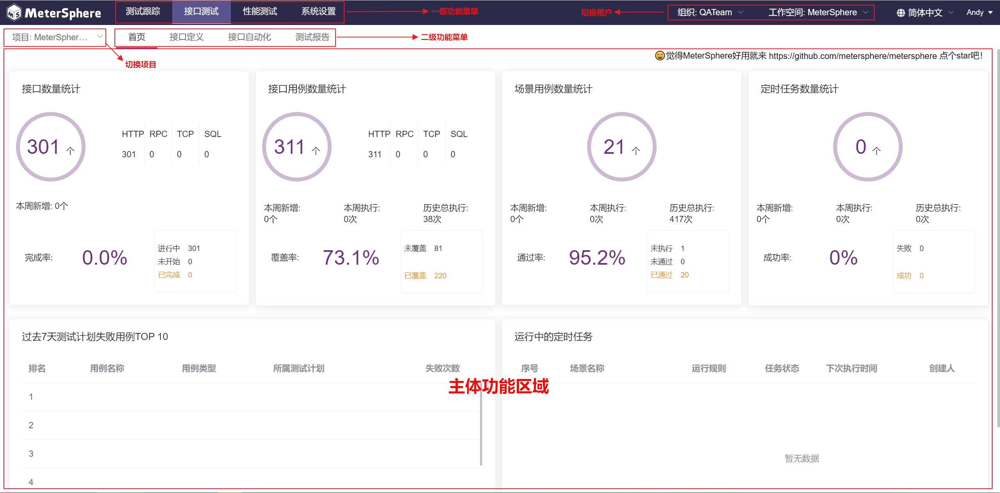

我们为用户准备了可以快速部署 MeterSphere 所有组件及所需的中间件的安装包。安装包分为包含 docker 镜像及不包含 docker 镜像两个版本，你可以根据自己的网络情况选择不同的安装包进行下载，快速部署并体验 MeterSphere 所提供的功能。

* 包含 docker 镜像的安装包：该安装包中附带了 MeterSphere 所需的所有 docker 镜像。如果你的部署环境无法访问外网，可以选择下载该离线包并上传到目标服务器上进行完全离线的部署。
* 不包含 docker 镜像的安装包：该安装包只包含了必要的安装脚本、配置文件及其他必要软件。如果你的部署环境可以访问外网，可以选择下载该离线包并上传到目标服务器，通过在线拉取 docker 镜像的方式进行部署。

## 部署服务器要求

!!! info "部署服务器要求"
    * 操作系统: 任何支持 Docker 的 Linux x64
    * CPU/内存: 2核4G（最小）
    * 磁盘空间: 20G

## 安装步骤

### 下载安装包

从安装包下载地址下载最新的安装包，上传至目标服务器任意目录并解压
```sh
tar zxvf metersphere-release.tar.gz
```

### 修改安装配置（可选）

进入安装包解压后的目录，编辑修改安装参数

```sh
cd metersphere-release
vim install.conf
```

??? info "安装配置文件说明, 如果无特殊需求可以不进行修改采用默认参数安装"
    ```vim
    # MeterSphere 安装目录的上级目录, MeterSphere 将安装在 ${base_dir}/metersphere 目录中
    #base_dir=/opt
    # MeterSphere 相关组件所使用 Docker 镜像的镜像标签
    #metersphere_image_tag
    # 安装模式, 支持的安装模式有 allinone | server | node_controller 三种
    #install_mode=allinone
    # MeterSphere Server 组件的服务端口
    #metersphere_server_port=8081
    # 是否使用外部 MySQL 数据库
    #external_mysql=false
    # MySQL 数据库地址, 仅在 external_mysql=true 时有效
    #mysql_host=mysql
    # MySQL 数据库端口, 仅在 external_mysql=true 时有效
    #mysql_port=3306
    # MySQL 数据库名称, 仅在 external_mysql=true 时有效
    #mysql_dbname=metersphere
    # MySQL 数据库用户名, 仅在 external_mysql=true 时有效
    #mysql_username=root
    # MySQL 数据库密码, 仅在 external_mysql=true 时有效
    #mysql_password=Password123@mysql
    # 是否使用外部 Kafka
    #external_kafka=false
    # 用于接收性能测试结果数据的 Kafka Topic 名称, 仅在 external_kafka=true 时有效
    #kafka_topic=JMETER_METRICS
    # Kafka 连接地址, 仅在 external_kafka=true 时有效
    #kafka_host=本机IP地址
    # Kafka 连接端口, 仅在 external_kafka=true 时有效
    #kafka_port=19092
    # 用于接收性能测试日志数据的 Kafka Topic 名称, 仅在 external_kafka=true 时有效
    #kafka_log_topic=JMETER_LOGS
    ```

在安装包解压后所在目录，执行如下命令

```sh
./msctl.sh install
```

安装脚本默认使用 /opt/metersphere 目录作为安装目录，MeterSphere 的配置文件、数据及日志等均存放在该安装目录

## 登录并使用

### 登录

安装成功后，通过浏览器访问如下页面登录 MeterSphere

```
地址: http://目标服务器IP地址
用户名: admin
密码: metersphere
```

### 界面说明



### 维护项目信息

1. 点击页面最上方的「测试跟踪」菜单，在下方的项目下拉列表中选择「创建」项目
2. 输入项目基本信息，点击「确定」按钮，完成项目创建

### 跟踪测试计划

#### 测试用例管理

1. 在「测试跟踪」功能下的「测试用例」下拉列表中，选择「显示全部」，弹出项目中的所有测试用例
2. 点击左侧用例模块树的「新建模块」按钮，创建一个新的用例模块
3. 点击右侧列表中的「新建用例」按钮，在弹出的用例信息编辑页面中填写用例基本信息，点击「确定」完成用例创建

#### 测试计划管理

1. 在「测试跟踪」功能下的「测试计划」下拉列表中，选择「创建测试计划」，弹出测试计划编辑页面
2. 填写测试计划的基本信息，并选择测试计划的所属项目及测试阶段，点击「确定」按钮完成测试计划创建
3. 在测试计划列表中点击某一测试计划，进入测试计划详情页面
4. 点击右侧测试用例列表中的关联测试用例按钮，在弹出的测试用例列表中，选择项目中的测试用例添加至该测试计划
5. 添加成功后即可在测试用例列表查看到已添加的测试用例
6. 点击某个测试用例所在行的编辑按钮，进行测试用例结果更新
7. 当所有测试用例结果均更新后，即可点击用例列表中的查看测试报告按钮，查看此次测试计划的测试报告

### 执行接口测试

### 执行性能测试

